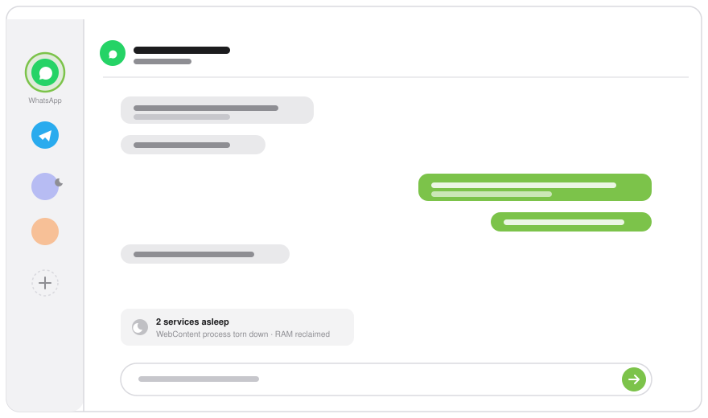

<div align="center">



# Wasabi

**For people who live in their chat apps — and resent what Electron costs their Mac.**

One native window. Every service isolated. Inactive ones torn down to reclaim their RAM.


</div>

---

## What it is

Wasabi hosts your web chat apps — WhatsApp Web, Telegram, and anything you add
by URL — in a single native macOS window, each behind a vertical icon sidebar.

It runs on the system's own web engine (WebKit / `WKWebView`), not a bundled
Chromium. And it does the one thing no browser wrapper does: when you switch
away from a service, Wasabi can **tear it down entirely** — the whole WebContent
process exits and its RAM goes back to your Mac. Switch back and it reloads from
its own persistent session, still logged in.

It is **not** a browser. No address bar, no general browsing. Just your chats,
pinned, isolated, and light.

## How it compares

| | **Wasabi** | WhatsApp app | Beeper | Browser wrappers (Unite, Coherence) |
|---|---|---|---|---|
| **Engine** | Native WebKit | Electron / Catalyst | Electron | Native WebKit (usually) |
| **Many services, one app** | ✅ any web app, add by URL | ❌ WhatsApp only | ✅ via their bridges | ➖ one app per site |
| **RAM, idle** | **~0 per slept service** | ~300–700 MB for one | ~1–2 GB+ | ~150–400 MB per site, all live |
| **Sleeps inactive services** | ✅ exits the WebContent process | ❌ | ❌ | ❌ |
| **Session isolation** | ✅ separate data store per service | single | server accounts | ✅ per app |
| **How messages route** | direct to each web app | direct | via Beeper's servers | direct |
| **Privacy** | local only, no middleman | direct | traverse a third party | local only |
| **Native, no Electron** | ✅ | ❌ (mostly) | ❌ | ✅ |

**The trade-off is deliberate.** Wasabi ships fewer features than the bridge
apps — no unified inbox, no plugins, no cross-service search. It does one thing:
host your web apps with native efficiency, and idle near zero where Electron
clients sit at gigabytes. If you want a feature kitchen-sink, Beeper or Ferdium
are richer. If you want your chats in one native window without surrendering your
RAM, that's the whole point of Wasabi.

## What you get

| | |
|---|---|
| **WhatsApp + Telegram on first launch** | Each in its own isolated `WKWebView`; click a sidebar icon to switch. |
| **Add any service by URL** | The "+" takes a URL (`app.slack.com` works) and a name. Rename, re-URL, remove, or drag to reorder. Built-ins are just the seed — your list is the source of truth. |
| **Per-service sleep policy** | Right-click an icon: *keep running* / *sleep after 5 min* / *smart adaptive*. A slept service exits its content process and reloads on wake — no re-login. |
| **Isolated persistent sessions** | Each service has its own `WKWebsiteDataStore`, so logins survive relaunch and never cross between services. Removing one deletes its store cleanly. |
| **Native notifications** | Banners + sound, grouped per service, click-to-activate — bridged into `UNUserNotificationCenter`. A slept service raises none. |
| **Resizable native sidebar** | Wide / Medium / Compact (remembered). Wide is a full-height source-list layout; asleep services dim to show reclaimed RAM. |
| **Dynamic Dock icon** | Generated from your active services' favicons. |
| **In-app update check** | A lightweight check offers a download when a newer version ships. No embedded update framework. |

## Install

Wasabi ships as a **notarized, Developer ID-signed DMG** — open it, drag Wasabi
to Applications, launch. Gatekeeper-clean, so no right-click-to-open or security
warning. The signed, auto-updating build and Pro features are distributed by the
author.

Prefer to build it yourself? See below — it's free.

## Build from source

**Command Line Tools only — no Xcode required.**

```sh
scripts/make-signing-cert.sh   # one-time: stable local "Wasabi Dev" signing identity
scripts/build-app.sh           # compile Sources/ with swiftc → build/Wasabi.app
open build/Wasabi.app
```

| Script | Purpose |
|--------|---------|
| `scripts/build-app.sh` | Compile + assemble + locally sign `build/Wasabi.app`. |
| `scripts/make-signing-cert.sh` | Create the stable self-signed identity the build uses. |
| `scripts/make-icns.sh` | Regenerate `Resources/AppIcon.icns`. |
| `scripts/measure-ram.sh` | Measure the real per-process memory footprint (the headline benchmark). |

A source build is unsigned and does not auto-update; Pro features are locked.
There is no automated test target — verify changes by building and exercising the
affected behavior (webview, menu, upload, notifications, sleep/wake).

## How it works

**Sleep is the RAM lever.** One service is always live (the active one). The rest
follow their per-service policy via timers. When a service sleeps, its
`WKWebView` is torn down and the WebContent process exits — the only way to
actually reclaim per-service memory. Waking rebuilds it from the persistent data
store, so you stay logged in. Smart Sleep keeps a service warm for a short grace
period after you switch away (so flicking between chats doesn't pay a cold
reload), and the grace shortens once you leave Wasabi for another app.

**Isolation lives in the data store, not the process.** Every service is keyed to
a stable `WKWebsiteDataStore(forIdentifier:)`, so sessions never cross — even
though all WebViews share one WebKit process pool so memory is coordinated across
them.

## Requirements

- macOS 15+ (Apple Silicon)
- Xcode Command Line Tools (`xcode-select --install`) — only to build from source

## Who it's for

- People who keep several chat apps open all day and feel the RAM cost
- Mac users who'd rather run native WebKit than yet another Electron client
- Anyone who wants their web chats isolated, logged in, and light — in one window

## Who it's not for

- People who want a unified inbox, plugins, or cross-service search — that's Beeper/Ferdium
- People who want general web browsing — Wasabi has no address bar by design
- Windows or Linux users — macOS only

## License

Source-available under the [PolyForm Noncommercial License 1.0.0](LICENSE) —
© 2026 Alessandro Smedile. Free to read, build, modify, and use for any
noncommercial purpose; commercial use requires a separate license. The paid,
notarized, auto-updating build and Pro features are distributed only by the
author. Wasabi hosts third-party web services (WhatsApp, Telegram, …) governed
by their own terms; this license covers the Wasabi app only.

**Contributing:** see [`CONTRIBUTING.md`](CONTRIBUTING.md) for the contributor
terms (DCO + commercial-rights grant that keeps the dual-license model viable),
and [`AGENTS.md`](AGENTS.md) for build, structure, and style.

**Privacy:** no servers, no telemetry — everything stays in local WebKit storage
([`PRIVACY.md`](PRIVACY.md)).
